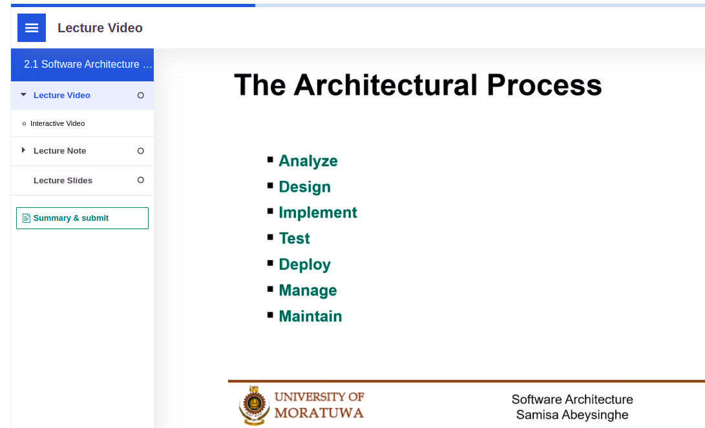

# Software Architecture

Software architecture refers to the fundamental structures of a software system and the discipline of creating such structures and systems. Each structure comprises software elements, relations among them, and properties of both elements and relations. The architecture of a software system is a metaphor, analogous to the architecture of a building. It functions as a blueprint for the system and the developing project, laying out the tasks necessary to be executed by the design teams.

# The Architectural Process

