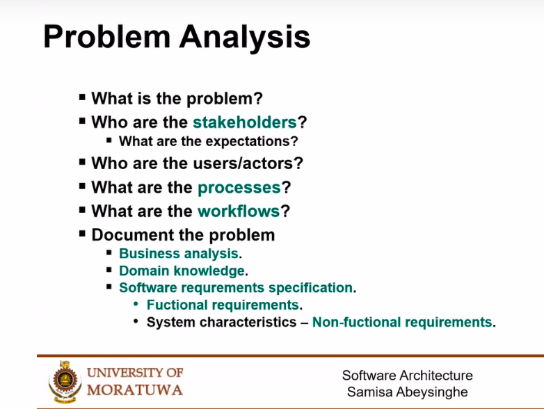

# Software Architecture

Software architecture refers to the fundamental structures of a software system and the discipline of creating such structures and systems. Each structure comprises software elements, relations among them, and properties of both elements and relations. The architecture of a software system is a metaphor, analogous to the architecture of a building. It functions as a blueprint for the system and the developing project, laying out the tasks necessary to be executed by the design teams.

# The Architectural Process

# Problem Analysis

# Use Case Diagrams

A use case diagram is a graphical depiction of a user's possible interactions with a system. A use case diagram shows various use cases and different types of users the system has and will often be accompanied by other types of diagrams as well. The use cases are represented by either circles or ellipses. The actors are often shown as stick figures.

https://en.wikipedia.org/wiki/Use_case_diagram

# Architecture Diagram

An architecture diagram is a visual representation of all the elements that make up part, or all, of a system. Above all, it helps the engineers, designers, stakeholders — and anyone else involved in the project — understand a system or app’s layout.

https://www.lucidchart.com/blog/how-to-draw-architectural-diagrams

# Software as Programming?

# Architecture Process Recap

## ISO 25000

https://iso25000.com/index.php/en/iso-25000-standards/iso-25010